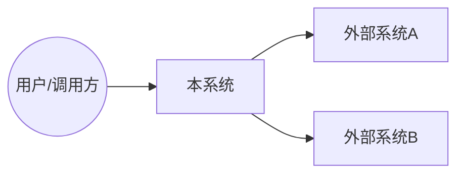
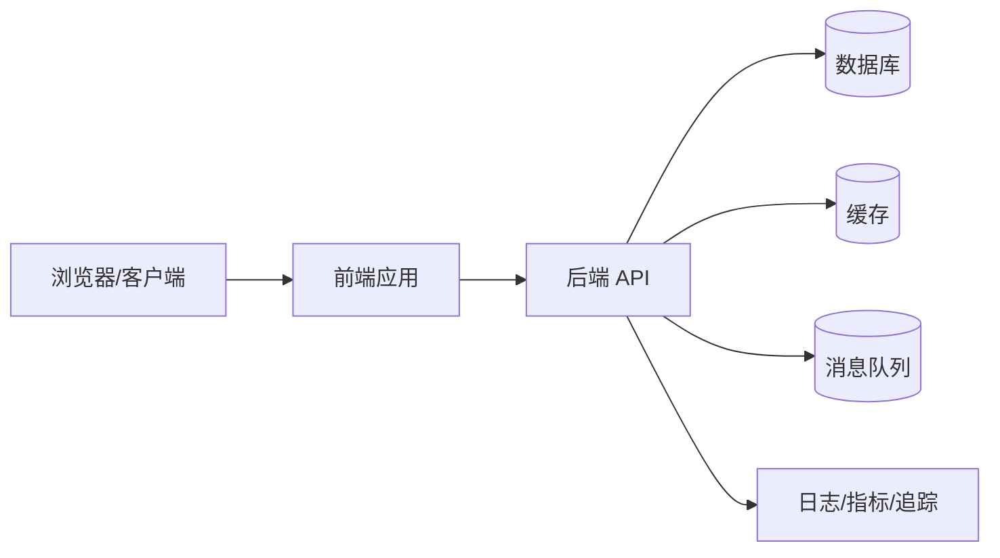

# 01 系统全景与边界（C4）

## 1. 系统边界
- 本系统负责：
- 本系统不负责：
- 外部系统/第三方依赖：
- 信任边界：

## 2. C4 - Context 图

## 3. C4 - Container 图

## 4. 运行单元清单
| 单元 | 类型 | 入口 | 代码路径 | 协议/端口 | 依赖 | 备注 |
|---|---|---|---|---|---|---|

## 5. 边界说明
- 对外接口：
- 对内依赖：
- 数据边界：
- 配置边界：

## 6. 证据来源
- `docs/architecture/.evidence/services.json`
- `docs/architecture/.evidence/entrypoints.json`
- `docs/architecture/.evidence/infra-surface.md`
