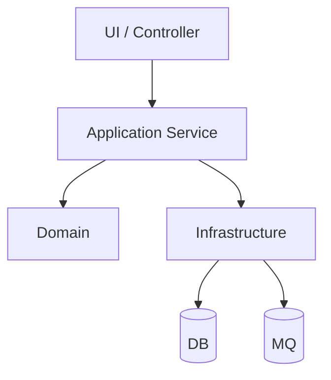

# 02 模块地图与职责划分

## 1. 模块总览
| 模块 | 职责 | 代码路径 | 关键入口 | 依赖 | 重要度 | Owner |
|---|---|---|---|---|---|---|

## 2. 分层结构（如适用）

## 3. 模块分组建议
- 领域模块：
- 平台模块：
- 适配器模块：
- 基础设施模块：

## 4. 模块页索引
为每个 P0/P1 模块生成：
- `modules/<模块>.md`

## 5. 证据来源
- `docs/architecture/.evidence/repo-map.md`
- `docs/architecture/.evidence/services.json`
- `docs/architecture/.evidence/entrypoints.json`
