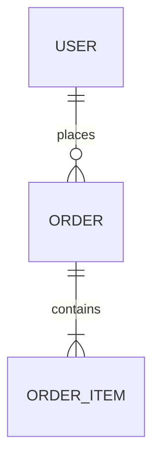

# 03 数据架构

## 1. 数据存储清单
| 存储 | 类型 | 用途 | 路径/配置 | 备份/保留 | 一致性要求 |
|---|---|---|---|---|---|

## 2. 核心实体与关系

## 3. 表/集合设计（抽取自迁移/模型）
| 表/集合 | 主键 | 关键字段 | 索引 | 备注 |
|---|---|---|---|---|

## 4. 数据流
- 写入路径：
- 读取路径：
- 聚合路径：
- 缓存路径：

## 5. 一致性与事务边界
- 强一致覆盖：
- 最终一致事件：
- 幂等键：
- 补偿策略：

## 6. 缓存策略（如有）
| Key 模式 | TTL | 写策略 | 失效策略 | 命中率目标 |
|---|---:|---|---|---:|

## 7. 证据来源
- `docs/architecture/.evidence/data-surface.md`
