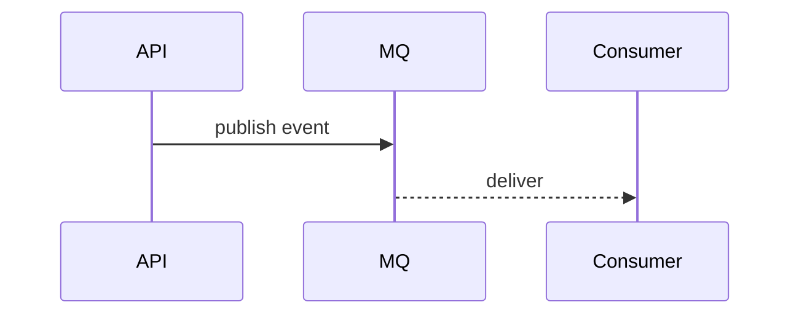

# 05 集成与异步

## 1. 外部集成清单
| 外部系统 | 方式 | 目的 | 认证 | 超时/重试 | 代码路径 |
|---|---|---|---|---|---|

## 2. MQ / 事件总线
| MQ | Topic/Queue | 生产者 | 消费者 | Schema | 重试/死信 |
|---|---|---|---|---|---|

## 3. 事件驱动流程

## 4. 幂等与去重
- 幂等键来源：
- 去重窗口：
- 投递语义：

## 5. 失败处理
- 重试策略：
- DLQ：
- 人工补偿：
- 重放策略：

## 6. 证据来源
- `docs/architecture/.evidence/events-surface.md`
