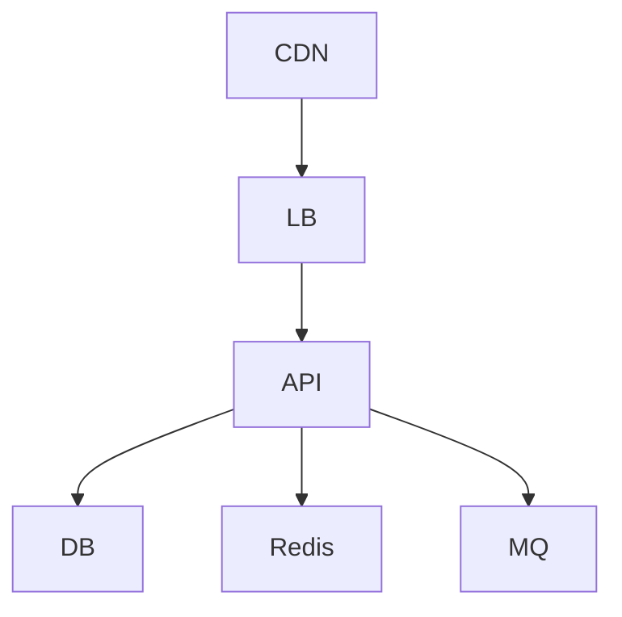

# 08 部署与容量规划

## 1. 部署拓扑

## 2. 配置与密钥
- 配置来源：
- 环境隔离：
- 密钥管理：

## 3. 容量模型
| 资源 | 单实例能力 | 峰值需求 | 副本数 | 备注 |
|---|---:|---:|---:|---|

## 4. 压测计划
- 压测工具：
- 核心场景：
- 成功标准：

## 5. 灰度与回滚
- 灰度策略：
- 回滚步骤：
- 数据兼容策略：

## 6. 证据来源
- `docs/architecture/.evidence/infra-surface.md`
- `docs/architecture/.evidence/stack.json`
