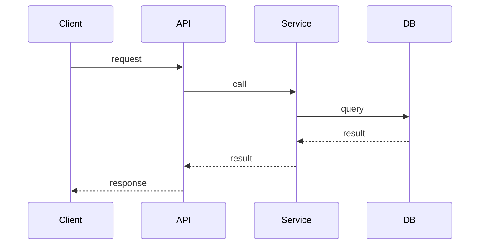

# 模块：<模块名>

## 1. 职责与边界
- 做什么：
- 不做什么：
- 上下游：

## 2. 代码位置（可追溯）
- 主要目录：
- 关键文件：
- 入口（main/router/controller）：

## 3. Inbound / Outbound
### Inbound
| 类型 | 名称 | 说明 | 证据 |
|---|---|---|---|

### Outbound
| 类型 | 目标 | 用途 | 证据 |
|---|---|---|---|

## 4. 关键流程（时序图）

## 5. 一致性与可靠性
- 幂等：
- 超时/重试：
- 补偿：

## 6. 可观测性
- 指标：
- 日志字段：
- 告警建议：

## 7. 变更影响与回滚
- 影响范围：
- 兼容性：
- 回滚策略：

## 8. 证据来源
- `docs/architecture/.evidence/...`
